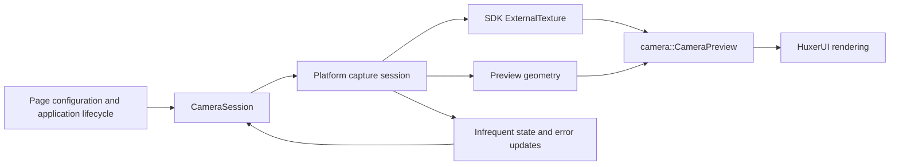

# HuxerUI Camera Module Design

Status: the shared API, session ownership, preview drawing, Android capture, independent macOS/iOS AVFoundation backends, and Windows Media Foundation capture are implemented. Android preview, geometry, switching, and background recovery were confirmed on TAS_AN00 after updating the installed SDK. iOS device and Simulator targets build with the corrected SDK dependency exports, and the Simulator example launches; the user also confirmed successful physical iOS device testing after the SDK link fix. Windows preview and JPEG capture were verified at 1280×720 with an ACER HD User Facing camera, and the user confirmed the example works. See README.md for build limitations and verified implementation status.

## Design Decision

The Camera module manages capture through `CameraSession`, publishes preview frames through platform `ExternalTexture` implementations, and displays them inside HuxerUI through `camera::CameraPreview`.

The default implementation does not embed Android PreviewView or Apple native preview layers through PlatformView. The camera produces frames; HuxerUI handles layout, clipping, transforms, gestures, and surrounding UI. If later measurements justify native preview on a particular platform, evaluate it separately. The initial version does not offer two interchangeable preview backends.



The initial version supports default, front, and back camera selection; asynchronous start and stop; preview; orientation and mirroring; foreground recovery; device errors; and resource cleanup. It also supports asynchronous JPEG still photos. It excludes recording, barcode scanning, beauty effects, raw frame subscriptions, manual exposure, concurrent cameras, and a device enumeration UI. Public interfaces for those features are not defined in advance.

## Verified SDK Constraints

The current project build cache points to `/Users/harvenguo/Library/Developer/HuxerUI`. Verify the active SDK again during implementation rather than embedding this machine-specific path in the build configuration.

| Public contract | Design implication |
| --- | --- |
| Publishing an `ExternalTexture` frame updates its revision and requests rendering without requiring View recomposition | Do not write every frame to UI State or send it through PlatformChannel |
| The renderer must recognize the concrete texture type | Compose SDK platform textures within Session instead of introducing a `CameraTexture` subclass |
| A texture's `IntrinsicSize()` is immutable | Create a new texture when logical dimensions change; handle physical pixel dimensions separately from UI dimensions |
| `IsActive()` is only a visibility hint | Do not use it to determine device ownership, start, pause, or shutdown |
| A concrete texture cannot publish after `Finish()`, and retains its last frame | Recreate producer resources when resuming after a complete stop; CameraPreview explicitly removes stale output |
| `Image` and `PaintContext::DrawImageRect()` accept shared textures | Implement CameraPreview through existing drawing APIs without accessing private renderers |
| `OpenPlatformModule()` is restricted to committed Lifecycle setup | Composition creates declarations and handles without opening devices |
| `ApplicationHandle` already provides camera permission and application lifecycle APIs | Reuse the SDK instead of introducing separate permission or application lifecycle systems |

The relevant public headers are `external_texture.h`, each platform's `external_texture.h`, `app.h`, `system.h`, `root.h`, `platform_registry.h`, `paint.h`, and `state.h`.

## Proposed Public Interface

Keep `include/huxerui/camera.h` as the public header, `huxerui::camera` as the namespace, and `HuxerUI::Camera` as the public CMake target.

The declarations below describe the proposed API shape and semantics. Includes, private members, and implementation details are omitted. Verify the complete declarations when implementing them.

```cpp
namespace huxerui::camera {

enum class Facing { Front, Back };
enum class MirrorMode { Auto, Off, On };
enum class PreviewRotation { R0, R90, R180, R270 };

enum class SessionState {
  Stopped,
  Starting,
  Running,
  Stopping,
  Suspended,
  Failed,
  Closed,
};

enum class CameraErrorCode {
  PermissionRequired,
  PermissionDenied,
  Unavailable,
  DeviceNotFound,
  DeviceBusy,
  DeviceDisconnected,
  ConfigurationFailed,
  CaptureFailed,
  NotReady,
  OperationInProgress,
  Interrupted,
};

struct CameraError {
  CameraErrorCode code;
  std::string message;
};

template <class T> using CameraResult = Result<T, CameraError>;

struct PhotoOptions {
  int jpeg_quality = 90;
  MirrorMode mirror = MirrorMode::Off;
};

struct CameraOptions {
  std::optional<Facing> facing;
  bool active = true;

  bool operator==(const CameraOptions&) const = default;
};

struct PreviewOptions {
  ImageFit fit = ImageFit::Cover;
  MirrorMode mirror = MirrorMode::Auto;
};

struct PreviewOutput {
  std::shared_ptr<ExternalTexture> texture;
  Rect crop = {0.0F, 0.0F, 1.0F, 1.0F};
  PreviewRotation rotation = PreviewRotation::R0;
  bool mirrored = false;
};

struct CameraStatus {
  SessionState state = SessionState::Stopped;
  std::optional<Facing> actual_facing;
  std::optional<CameraError> error;
  std::optional<PreviewOutput> preview;
  bool capturing_photo = false;
};

class CameraSession {
public:
  [[nodiscard]] CameraStatus Status() const;
  void Retry() const;
  [[nodiscard]] Task<CameraResult<ImageAsset>> CapturePhotoAsync(PhotoOptions options = {}) const;
};

void Install(RootContext& root);

[[nodiscard]] CameraSession UseCamera(
    CameraOptions options = {},
    const std::source_location& location = std::source_location::current()
);

[[huxerui::composable]]
View CameraPreview(CameraSession session, PreviewOptions options = {});

} // namespace huxerui::camera
```

### Interface Semantics

`CameraSession` is a copyable, stable handle rather than a native device object. `UseCamera()` retains the same handle at the same composition call site; configuration changes update that session's desired configuration. `location` forwards the caller's source location to the internal state retention logic. Owners in dynamic lists still require stable semantic keys.

`UseCamera()` must run in a composition context. Like an ordinary custom hook, it uses the caller's composition scope. Reusable components that call it directly require `[[huxerui::composable]]`. Define `CameraPreview` in a `.cpp` file so the existing composition code generator can process it.

`Status()` returns a consistent value describing the current session status. Reading it during composition subscribes to subsequent state changes. Background callbacks must not directly read or write this UI state. CameraPreview reads the same status instead of introducing another state channel.

`CameraOptions::active` is the sole source of start and stop intent. The initial API does not expose `Start()`, `Stop()`, and `.active` together, avoiding conflicting controls. `Retry()` requests another attempt with the current configuration only in `Failed`; it does not modify `.active` or present permission UI. It has no effect in other states and cannot reopen a closed handle.

`Facing` describes only Front or Back. An empty `CameraOptions::facing` selects the platform's default video capture device. An explicit Front or Back request returns `DeviceNotFound` when no matching device exists, without silently selecting the opposite facing. `actual_facing` is empty until the facing is known, including for external devices whose facing cannot be determined. Desktop examples leave the requested facing empty.

`PreviewOutput` delivers the texture together with the geometry required to interpret it. The API does not provide a separate `PreviewTexture()` shortcut that could discard this information. Advanced callers can draw `Status().preview` themselves, subject to the geometry and ownership contracts.

Multiple CameraPreview instances can consume one Session. CameraPreview does not start or stop the device, and unmounting one CameraPreview does not affect another. The session owner should be a common ancestor of those previews.

### Page Usage Example

This example assumes the page has already obtained authorization through the SDK. Application state controls `active`, and the page supplies bounded layout. The shared Camera APIs are implemented; native capture availability depends on the backend status in README.md.

```cpp
[[huxerui::composable]]
View CameraContent(bool active) {
  auto session = camera::UseCamera({
      .facing = std::nullopt,
      .active = active,
  });

  return camera::CameraPreview(session, {
      .fit = ImageFit::Cover,
      .mirror = camera::MirrorMode::Auto,
  });
}
```

Applications that need an error page or startup indicator read `session.Status()` and compose ordinary HuxerUI components. CameraPreview does not include text, authorization buttons, camera toolbars, or tap-to-focus behavior.

## Still Photos and File Export

`CapturePhotoAsync(PhotoOptions)` returns `Task<CameraResult<ImageAsset>>`. `CameraResult<T>` reuses the SDK Result implementation with CameraError; ImageAsset already owns the encoded image, format, and dimensions. No camera-specific photo container or file result type is needed.

A session accepts one still request at a time without queuing. It stays Running while `capturing_photo` is true; canceling the caller suppresses result delivery without admitting another capture before native cleanup. Stop, switch, background, close, and reported session interruptions resolve accepted work as Interrupted. Ordinary photo errors stay local to that result and do not populate CameraStatus::error. Generation and request identity checks discard stale callbacks.

The first format is JPEG, with quality 1–100 and scale 1. The native target orientation and resolved mirror mode are frozen on acceptance. Each backend normalizes pixel orientation, optionally mirrors the upright pixels, and emits a JPEG that requires no EXIF rotation. Photo mirroring defaults to Off. Auto mirrors confirmed front cameras. Preview layout, crop, fit, and mirror settings have no effect on still capture. Native output negotiates photo dimensions independently; maximum-resolution photography, HDR, RAW, metadata retention, and recording are outside this phase.

Android binds ImageCapture with Preview and performs JPEG normalization on a separate executor. The iOS and macOS implementations remain separate; each owns AVCapturePhotoOutput, a per-request delegate retained through final capture, and a photo processing queue. Stop completion waits for both preview release and photo cleanup. Unsupported preview/photo output combinations fall back to preview where configuration APIs can detect the limitation.

The current SDK has no public callback-to-Task completion primitive. The private request stores one completion behind a condition variable; RunWorker bridges that completion through the SDK's existing cancellation and UI-dispatch contract. Native callbacks never directly resume coroutine frames. At most one such wait belongs to a session, and interruption releases it independently of native cleanup.

Saving is composed with the SDK File and FilePicker APIs. Write ImageAsset::EncodedBytes() to an application-owned file, or prepare a temporary file and pass it to FilePicker::SaveFileAsync() for user-directed export. CameraSession does not add a duplicate SavePhotoAsync wrapper, select paths, or create photo-library entries. The example supports capture, photo review, and file export. See README.md for complete English usage examples and validation scope.

## Ownership and Lifecycle

| Object | Owner | End of lifetime |
| --- | --- | --- |
| Session handle and observable status | The composition lifetime containing `UseCamera()` | Enters Closed when the owner unmounts; external handles can still read the terminal state |
| Platform capture implementation | Session's committed lifecycle | Owner unmount; the backend may be reused after its native resources are fully stopped |
| Native capture resources | Platform implementation | Released after the platform confirms it no longer uses the output resources |
| Current texture | Session; render snapshots may also hold references | Finished after stopping; final release follows reference lifetime |
| Display options and drawing content | Each CameraPreview | CameraPreview update or unmount |

Copying a Session handle does not extend hardware capture lifetime. Owner unmount must actively close capture even if other objects retain handles or textures. Retaining a finished texture may preserve a frozen image, but cannot keep the camera running.

Normal operation requires `.active == true`, an application state other than Background, usable authorization, and a backend capable of capture. Inactive means the application remains visible without accepting interaction, so the initial version does not release the camera merely because a desktop window loses focus. Actual mobile capture interruptions are still handled through platform events. Background always stops capture in the initial version; background camera operation is not supported.

Permission checks, startup, and shutdown are asynchronous. Composition functions neither perform blocking work nor present system authorization UI.

### State Transitions

| Condition or event | Target state and action |
| --- | --- |
| Initial declaration before committed setup | Stopped |
| active is true, the application is in the foreground, and authorization checks or device opening begin | Starting |
| The native capture session starts successfully | Running |
| active becomes false | If resources are held, enter Stopping, then Stopped after release |
| The application enters Background while active remains true | If resources are held, enter Stopping, then Suspended after release |
| A Suspended session returns to the foreground while active remains true | Check authorization again and enter Starting |
| facing changes while running | Enter Stopping, close the old device, then enter Starting with the latest configuration |
| A permission, device, or capture operation fails | Complete necessary resource cleanup, then enter Failed and retain the error |
| Explicit Retry after Failed, or a change to the desired configuration | Enter Starting when in the foreground with active true; otherwise wait for those conditions |
| The owner unmounts | Immediately mark the handle Closed and invalidate callback delivery; platform cleanup continues until complete |

Running means the capture pipeline has started; it does not guarantee that the first frame has appeared. The initial version exposes no FirstFrame event. In particular, the public Android Surface interface must not be assumed to provide a reliable render completion notification.

Recovery from Suspended may make one automatic attempt. An ordinary Failed state does not retry on unrelated recomposition or start a periodic retry loop. Moving a failed session into the background may clean up resources and retain recovery intent; returning to the foreground makes at most one recovery attempt.

Remove `preview` from the public status as soon as stopping, failure, device switching, or suspension begins, preventing old device output from remaining visible under a new state. The SDK's last-frame retention supports safe cleanup rather than defining CameraPreview's default stopped appearance.

## Preview Geometry Contract

### Coordinate Conventions

Geometry describes the texture that HuxerUI actually samples. It must not simply copy raw sensor or platform metadata.

- `crop` uses normalized coordinates in the texture's logical space, with the origin at the top left, x increasing rightward, and y increasing downward. It covers the entire texture by default. Multiply it by `texture->IntrinsicSize()` to obtain the source sampling rectangle.
- `rotation` is the remaining clockwise rotation required for the valid region, limited to the four right-angle orientations.
- `mirrored` indicates whether the image, after that rotation, is already horizontally mirrored relative to an upright, non-mirrored image.
- If the backend has already rotated, cropped, or mirrored the actual output, remove those applied transformations from this description to avoid correcting them twice.

CameraPreview computes its display transform in this order: valid-region crop, orientation correction, final mirroring policy, Fit, and centered placement. `MirrorMode::Auto` displays confirmed front cameras mirrored, and back cameras or devices with unknown facing without mirroring. On and Off specify the final mirrored state rather than applying an unconditional extra flip.

The final mirror operation is `output.mirrored XOR desired_mirror`. This mirror operation affects preview only; PhotoOptions independently controls still-photo mirroring.

For cropped source dimensions `cw × ch`, a 90° or 270° rotation produces display dimensions `ch × cw`. Within a `vw × vh` destination, Contain uses `min(vw / sw, vh / sh)` and Cover uses `max(vw / sw, vh / sh)`, followed by centering and clipping to the destination. Other ImageFit values follow their corresponding semantics in the active SDK and must not silently map to Cover.

The parent supplies explicit CameraPreview bounds. The initial version does not promise intrinsic layout dimensions derived from asynchronous camera startup. Before output is available, CameraPreview retains its assigned layout area without drawing an image. The caller supplies backgrounds and placeholders.

### Drawing Implementation

Prefer composing Image when it can fully express the geometry. When source cropping and fitting after rotation are required, use one Canvas with the public `DrawImageRect`, `PushTransform`, and `PushClip` APIs. Do not introduce a Layout, NodeExtension, or private PaintCommand.

Canvas rerecords drawing only when geometry or layout changes. Frames continue to publish to the same ExternalTexture; the Canvas callback does not transfer pixels.

Retain the preview transform and its invertible parts internally for later reuse by focus handling and analysis overlays. The initial API does not expose a general coordinate conversion service or assume that future analysis output shares the preview's crop, aspect ratio, or frame timing.

### Texture and Geometry Changes

Geometry remains immutable within one output generation. Treat changes to orientation, source crop, or source mirroring semantics as new output: deactivate the previous output, create or switch to a new texture, and publish the new `PreviewOutput` atomically.

This prevents old frames from briefly appearing with new geometry and an incorrect orientation. The initial version permits a brief gap during a switch rather than introducing transitions between two simultaneous outputs or a complex pipeline with per-frame metadata.

Each backend must verify whether system transformations are already included in the Surface or buffer consumed by the SDK. If the existing public SDK contract cannot ensure consistent geometry for a new output, document the specific gap and discuss an SDK extension. Do not fill it by accessing private framework state or guessing matrices.

## Platform Integration

### Android

Use the CameraX Preview use case, connecting its SurfaceProvider to `android::SurfaceStreamTexture`. The implementation pins CameraX 1.5.3. The SDK already owns the SurfaceTexture/OES consumer; the Camera module does not create a duplicate OES consumer.

Create output using the actual resolution from SurfaceRequest. Obtain the Surface with a JNIEnv belonging to the calling thread and respect JNI local reference lifetimes. Keep the texture and necessary native references alive throughout CameraX's asynchronous use of the Surface.

Surface shutdown follows the producer's release protocol: stop or unbind the CameraX output, wait for notification that it no longer uses the Surface, then call Finish and release consumer resources. Request cancellation, configuration failure, and rapid switching must follow the same complete release path. Cancellation of a C++ request does not justify destroying a Surface still in use by the platform.

Provide a CameraX lifecycle binding owned by the module and controlled by Session. Do not modify the user's MainActivity or require separate host-side factory registration. Unbind only the current Session's use cases, without global unbinding that affects other camera consumers.

Read SurfaceRequest's TransformationInfo, verify which Surface transformations the SDK already consumes, and compute the remaining geometry. Do not unconditionally apply both the Surface transform and the full sensor rotation.

The current Android implementation exchanges commands and snapshots through one SDK PlatformChannel. The backend subscribes to its snapshot event once during creation; Start and Retry reuse that subscription with generation checks. Three private JNI resource operations create a Surface stream, obtain its Surface, and finish it. They pass retained ExternalTexture payloads, not numeric texture handles. Each Surface request owns its texture until the producer's result callback; disposal retains outstanding cleanup independently of the C++ session facade.

The initial full-frame path does not bind a ViewPort or effects. For direct camera Surfaces, the integration expects the SDK to consume the SurfaceTexture matrix into natural orientation, uses natural-orientation intrinsic dimensions, applies inverse display rotation, and reports native front mirroring. The user confirmed these preview behaviors on TAS_AN00; this does not establish compatibility with every camera device. Unexpected non-full cropping is rejected. Geometry changes invalidate the Surface request and publish a new immutable output generation. The user confirmed switching, all four orientations, mirroring, fitting, and background recovery on the tested device. Permission revocation and prolonged stress testing remain separate acceptance cases.

Report Unavailable when hardware acceleration or required EGL capabilities are missing. The initial version does not silently fall back to copying each frame into a Bitmap.

### iOS / macOS

Use an AVFoundation capture session and video data output to publish CVPixelBuffer frames to `ios::PixelBufferTexture` or `macos::PixelBufferTexture`.

Perform capture session configuration, start, and stop operations on a defined serial queue. UI bridge objects follow their main-thread contracts. After publication, callbacks may release the producer's own buffer reference but must not modify a buffer still retained by HuxerUI.

Select pixel formats according to the active SDK and rendering support on actual devices. Measure compatibility and cost for common BGRA and native YUV output. Publish accepting a CVPixelBuffer does not establish support for every format, HDR, or color attachment. SDR is the initial acceptance baseline.

iOS and macOS have separate Objective-C++ implementations in `platform/ios/src/camera.mm` and `platform/macos/src/camera.mm`. They share only the public API, session orchestration, and preview drawing. The iOS factory uses the public `ios::PlatformModuleFactory` to receive its owning UIViewController; the existing Swift Package declares native framework dependencies. There is no Swift capture implementation or per-frame language bridge.

The iOS output requests fixed portrait, unmirrored BGRA buffers from AVFoundation. PreviewOutput expresses the remaining clockwise rotation for the owning interface orientation: portrait 0°, landscape left 90°, upside-down 180°, and landscape right 270°. A transparent, noninteractive child view controller observes layout and rotation completion, reading UIWindowScene geometry or the owning controller orientation for hosts using the UIApplication lifecycle. It renders no preview content and is removed synchronously on stop. Device image checks must verify the mapping on front/back cameras and landscape-mounted iPad cameras.

AVFoundation session interruption temporarily reports Suspended while preserving the last preview. Interruption end resumes a still-requested session; runtime errors and disconnects report failure through the existing retry policy. Notification callbacks are serialized on the capture queue and rejected when they refer to a replaced session or device. Stop removes observers, disconnects the sample-buffer delegate, stops capture, finishes the texture, and only then completes. Shared application-background handling continues to release capture and restart according to declarative intent.

Camera declares its AVFoundation, CoreMedia, CoreVideo, and UIKit dependencies through its Swift Package. HuxerUI owns its application-level UserNotifications dependency, which is now included in the SDK export template and the installed package. Consumers receive it through the SDK CMake target.

### Windows

The backend uses Media Foundation Capture Engine with video-only device initialization. A private serial queue runs start, photo, and stop operations on Windows thread-pool workers initialized for COM MTA. Native event waits stay off the UI thread. Queue ownership retains capture resources through asynchronous cleanup; an explicit stop also satisfies backend destruction, avoiding duplicate stop scheduling.

The preview sink negotiates RGB32 output. Positive-stride samples upload directly from the locked media buffer to a BGRA D3D11 texture; negative-stride samples use a reusable buffer to reverse row order. Publication through the SDK's `windows::D3D11Texture` produces render snapshots without per-frame UI state changes. This path includes CPU-to-GPU upload and SDK snapshot copying; it does not promise zero-copy capture. Sample publication and texture Finish share a lock.

Default selection uses the first enumerated video device. Explicit facing matches Windows device enclosure metadata; unknown or opposite-facing devices are not substitutes. Preview rotation uses the selected stream's rotation metadata. The backend does not track changes from a device orientation sensor during capture.

Still capture uses the engine's preferred photo source and an in-memory JPEG sink, without requiring a separate physical photo stream. WIC normalizes EXIF orientation, falling back to stream rotation when EXIF orientation is absent, then applies final mirroring and JPEG quality. Stop is serialized after accepted photo work. A native photo timeout fails the session and shuts down the engine before another request can reuse it.

Automated image tests check all four corners for four stream rotations, all eight EXIF orientations, EXIF precedence, and final mirroring. Optional device tests cover frame publication, JPEG capture, pending-operation stops, strict facing selection, and restart. Device removal, permission revocation during capture, multiple GPU adapters, and sustained performance still require separate validation.

### Other Platforms

| Platform | Future integration direction | Separate validation required |
| --- | --- | --- |
| Linux | Choose `GdkTexture`, `GlTexture`, or `PixelTexture` according to capture output | Actual capture API, DMA-BUF synchronization, drivers, destruction thread |
| Web | Adapt captured frames to VideoFrame and publish through `VideoFrameTexture` | Browser support, the relationship between permission requests and media acquisition, main-thread constraints |

Linux and Web remain future directions, with buildable implementations that report Unavailable.

Web authorization may be tied to acquiring a media stream. Do not assume an independent CheckPermission call resolves that relationship. Verify the SDK permission contract against actual browser behavior before implementing Web support. At this stage, do not add a second permission API or a hidden DOM preview backend.

## Permissions and Errors

Applications manage authorization through the SDK's `CheckPermissionAsync(Permission::Camera)` and `RequestPermissionAsync(Permission::Camera)`. Session checks current authorization on each startup and recovery from the background rather than treating an earlier grant as permanent.

| Condition | Camera error |
| --- | --- |
| NotDetermined | PermissionRequired |
| Denied, PermanentlyDenied, or Restricted | PermissionDenied; detailed guidance follows the SDK permission state |
| Permission capability, capture backend, or required rendering capability is unavailable | Unavailable |
| No device matches the requested Facing | DeviceNotFound |
| The platform explicitly reports that the device is occupied | DeviceBusy |
| The device in use disconnects | DeviceDisconnected |
| Output or capture configuration fails | ConfigurationFailed |
| Another runtime capture failure occurs | CaptureFailed |

`message` contains diagnostic text. It is not a basis for application branching or default user-facing copy. When the platform cannot reliably distinguish a failure, report a more general error instead of inventing a precise cause.

The module and application shell configure the Android manifest, Apple usage descriptions, and required entitlements according to platform conventions. The application owns permission explanation text. The initial version does not request microphone permission.

## Threads, Cancellation, and Backpressure

The UI thread owns observable Session state, desired configuration, and lifecycle decisions. Platform queues own native device operations. Texture publication follows the threading constraints of the corresponding SDK type.

Allocate an internal, monotonically increasing generation identifier for each startup or output rebuild. Callbacks validate the generation and closed state before publishing output or posting UI updates. This identifier isolates stale work and is not part of the public API.

Generation checks do not replace synchronization. A publication callback that has already passed its check must still be serialized or protected by mutual exclusion against Finish. Destruction waits for required native operations already in progress. The UI handle may enter Closed first, while internal objects retain resources until cleanup completes.

Rapid configuration changes retain only the latest desired configuration. After closing the old device, start with that latest configuration rather than accumulating a queue of camera switches. Do not open the new device before the old one has been released.

CameraPreview uses a latest-frame policy. The module does not create an unbounded frame queue. Apple output may discard outdated preview frames, and Android follows the Surface protocol. The SDK and native platform may still have buffers in flight, so the design does not promise that the entire system retains only one frame.

Publish state changes from external threads through UI dispatch constrained by the owning lifecycle. Use the SDK's TaskScope or platform bridge dispatcher; do not access private State cells or use detached threads without an owner.

## Registration and File Organization

`Install(root)` registers one internal, strongly typed capture factory. The library centrally defines the registration name, proposed as `camera/Session`. Install does not open devices, request authorization, or create a global camera session.

The public CameraSession handles composition lifetime and domain state. The internal platform implementation handles system capture only. PlatformModule serves the device control boundary, while ExternalTexture handles frame production and display. Direct C++ paths remain strongly typed; only actual language boundaries use PlatformPayload or PlatformChannel. Application pages do not access those transport types.

Add the following files as their functionality is implemented, without creating empty interfaces or placeholder layers for every platform in advance:

```text
include/huxerui/camera.h
src/camera.cpp
src/camera_session.cpp
src/camera_preview.cpp
src/camera_internal.h
platform/android/src/main/cpp/...
platform/android/src/main/java/org/huxerui/lib/camera/...
platform/macos/src/...
platform/ios/src/camera.mm
platform/ios/Package.swift
platform/windows/src/camera.cpp
platform/windows/src/camera_photo.cpp
platform/windows/src/camera_windows.h
examples/preview/src/app.cpp
```

Keep only the contracts that Session and platform implementations must share in `camera_internal.h`. Geometry helpers can initially remain in `camera_preview.cpp`; do not extract a general graphics library before a second real consumer exists.

Do not modify generated host entry points to establish a second registration path. Add platform sources and dependencies through the current generated project structure. The iOS implementation uses the public native factory through CMake; the Swift Package contributes framework link dependencies.

## Implementation Order and Acceptance

### First Working Implementation

Start on macOS with an authorized Session lifecycle, pixel buffer publication, and CameraPreview drawing. The example includes a run toggle, state and error display, and two CameraPreview instances sharing one Session.

Then validate Surface requests and release, all four orientations, front-camera mirroring, and source cropping on Android. Use those results to establish whether PreviewOutput geometry covers actual output. Do not freeze the public geometry interface before Android validation is complete.

The independent iOS integration is complete. JPEG photo capture is implemented on Android, iOS, macOS, and Windows; complete physical-device acceptance for this path before expanding to recording, analysis, or additional platforms.

### Required Validation

| Scenario | Acceptance criteria |
| --- | --- |
| Repeatedly enter and leave the owning page | No lingering device ownership; capture stops on exit and can start on reentry |
| Rapid active and Facing changes | Converges on the latest configuration; stale callbacks do not overwrite new state or publish to finished textures |
| Two previews share one session | The device opens once; unmounting one preview does not stop the other |
| The session owner unmounts while a handle remains retained | The handle enters Closed and hardware resources are still released |
| Foreground/background changes and desktop focus loss | Background releases resources; foreground restores according to intent; Inactive does not unnecessarily cycle the device |
| Authorization is absent, denied, or revoked in system settings | No repeated automatic prompts; correct state and errors; retry is possible after user action |
| An external device disconnects or a device is occupied | Clear errors and resource cleanup without infinite retry |
| 0°, 90°, 180°, and 270° orientations with different destination aspect ratios | Correct orientation without distortion; Cover and Contain follow the contract |
| Front-camera Auto, On, and Off; devices with unknown facing | Correct final mirroring without duplicate flips |
| Orientation or device changes | No old frame displayed with new geometry; a brief placeholder is acceptable |
| Extended operation with intentionally reduced rendering frequency | Memory and buffers in flight do not grow continuously; preview latency does not accumulate |
| Rounded corners, transforms, and UI overlays | Behavior matches ordinary HuxerUI image rendering on the active platform |

Geometry mathematics and asynchronous lifecycle races warrant focused automated tests: use asymmetric markers to verify corner mapping and controlled callback ordering to verify shutdown and restart. Device release, Surface lifetime, permissions, orientation, and performance require checks on an available host or physical device. Mock tests alone do not establish that these scenarios pass.

Performance records should include the device, resolution, actual frame rate, end-to-end latency, CPU/GPU usage, memory, and behavior during extended operation. Compare with native preview when needed, without assuming zero-copy operation, minimum power consumption, or identical performance across platforms.

## Design Review

The design retains one public Session handle, one hook, and one CameraPreview. It does not introduce a parallel Controller, general frame bus, dual-backend mode, or pluggable processing graph. Declarative configuration controls operation, the SDK texture mechanism updates frames, and owner teardown actively releases hardware.

Physical iOS operation has been confirmed by the user. Remaining checks include successful-session asynchronous stop and stale-callback regression coverage, detailed iOS window-orientation and native-interruption cases, and Apple pixel-format compatibility and sustained performance. These are explicit implementation entry checks, not gaps to fill with invented SDK APIs. If validation requires changes to HuxerUI core, a broader public API, or another backend, report the concrete evidence and discuss it first.

## References

- The installed SDK public headers listed above. The Camera implementation depends only on public SDK interfaces.
- [CameraX output transformations](https://developer.android.com/media/camera/camerax/transform-output): custom Surfaces require handling crop and rotation metadata.
- [AVCaptureVideoDataOutput](https://developer.apple.com/documentation/avfoundation/avcapturevideodataoutput): Apple's video frame output interface.
- [AVCaptureConnection videoOrientation](https://developer.apple.com/documentation/avfoundation/avcaptureconnection/videoorientation): video data output can deliver physically rotated buffers.
